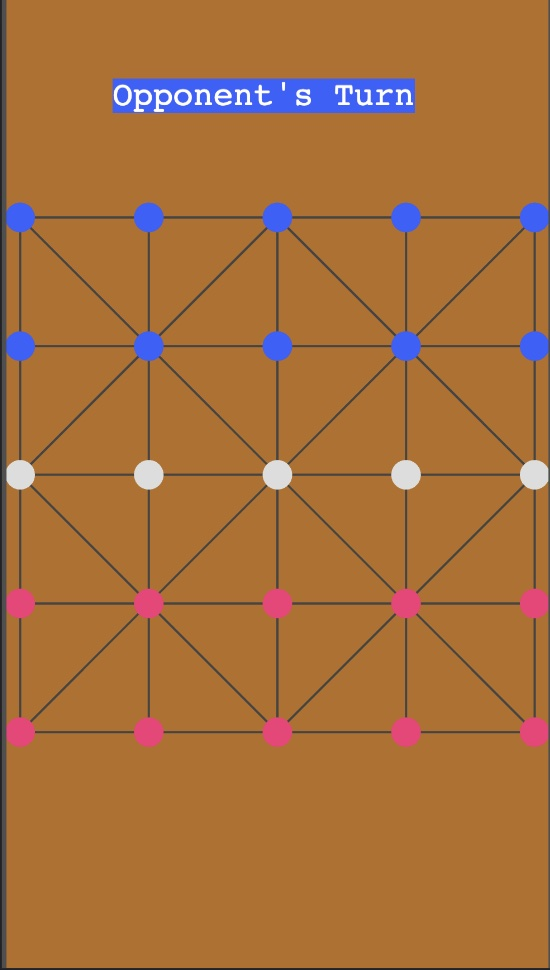

# 10 Guti Board Game

10 guti is a concept derived from famous Sholo Guti board game. Where beads are called gutis, each gutis can move 1 space 
vertically and horizontally, depending on it's position, it can also move diagonally.

## Tech Stack
The main tech stack used in this project is:
- Phaser 3
- Webpack
- Babel

In this repository only the Gameplay screen is designed. Other components of the game is designed using React Native for
Android and React JS for web. They are available in the following repo:
- Not yet published
- Not yet published

## Screenshots

